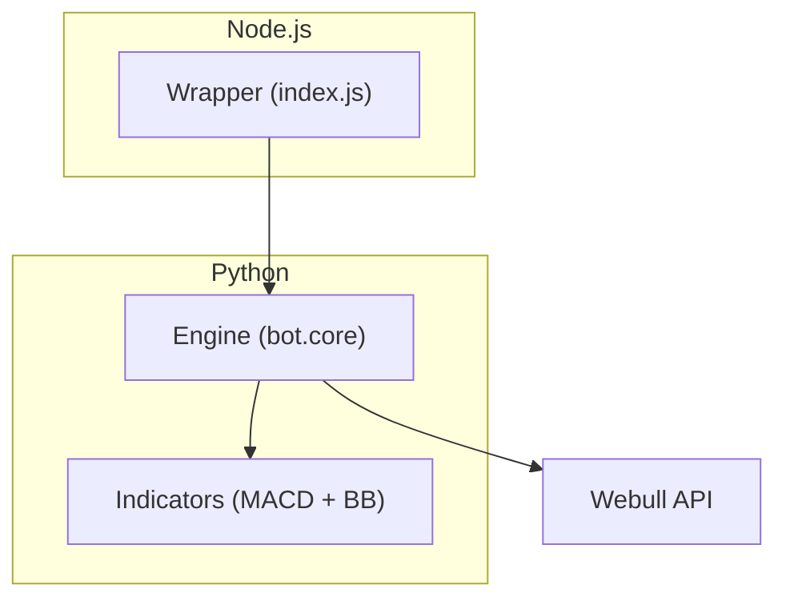

# Trade‑Bot
[](https://github.com/matboone/trade-bot/actions/workflows/ci.yml)
[](/LICENSE)


> **MACD + Bollinger Bands back‑tester**  
> Node.js orchestrator • Python strategy engine • Zero‑to‑trades in 60 sec

---

## Key features
| What | Why it matters |
|------|----------------|
| **End‑to‑end stack** | Node wrapper spawns Python, mimicking micro‑service orchestration. |
| **Config in one line** | `npm run bot -- --symbol=SOFI --interval=m30` (m1 / m5 / m15 / m30 / h1 / d1). |
| **Test‑first mindset** | CI runs an offline smoke test on every push; green badge proves it builds. |
| **.env‑driven credentials** | No secrets in code; works locally and in cloud runners. |
| **Ready for Docker & cron** | One command away from 24/7 scheduled runs. |

---

## Prerequisites

Before you begin, make sure you have the following:

1. **Git**  
   ```bash
   git --version
   # If not installed:
   # Mac:    brew install git
   # Windows: Download and run https://git-scm.com/download/win
   # Linux:   sudo apt install git
   ```
2. **Python 3.12+**
   ```bash
   python3 --version
   # If not installed:
   # Mac:    brew install python@3.12
   # Windows: Download from https://python.org/downloads
   # Linux:   sudo apt install python3.12 python3.12-venv
   ```
3. **Node.js 20 LTS + npm**
   ```bash
   node --version
   npm --version
   # If not installed:
   # Mac:    brew install node@20
   # Windows: Download from https://nodejs.org/
   # Linux:   curl -fsSL https://deb.nodesource.com/setup_20.x | sudo -E bash -
   #          sudo apt install nodejs
   ```
4. **WeBull Account**
   1. Go to https://www.webull.com and click Sign Up.

   2. Register with your email and create a password.

   3. Verify your email address.

   4. (Optional) Enable two-factor authentication for added security.

   You will use these credentials in a local .env file so the bot can log in.

   ---
   
## Quick start

```bash
# 1. Clone repository
git clone https://github.com/matboone/trade-bot.git
cd trade-bot

# 2. Copy and edit credentials
cp .env.example .env
# ─ open .env in your editor and fill in:
#   WEBULL_USER=<your email>
#   WEBULL_PASS=<your password>

# 3. Set up Python environment
python3 -m venv .venv
# ─ on Windows:
.\.venv\Scripts\activate
# ─ on macOS/Linux:
source .venv/bin/activate
pip install -r requirements.txt

# 4. Install Node dependencies
npm ci

# 5. Run a 7-day back-test on 30-min candles for SOFI
npm run bot -- --symbol=SOFI --interval=m30
```

---

## Architecture



---

## Disclaimer
This project is for educational purposes only. It does not constitute financial advice, and no live orders are executed by default. Use responsibly and at your own risk.
